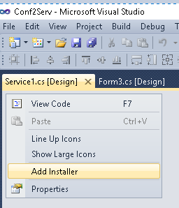

# addServiceInFormC-

<ol>
	<li>right click [Setup1]</li>
	<li>select [Add] - [Project Output]</li>
	<li>select [Primary output]</li>
	<li>select lov [WindowsService1] in Project:, and click [OK] buton</li>
	<li>right click [Setup1] - [View] - [Custom Actions]</li>
	<li>right click [Custom Actions] - [Add Custom Action]</li>
	<li>select [Application Folder], and click [OK] button</li>
	<li>select [Primary output from WindowsService1], and click [OK] button</li>
</ol> 

